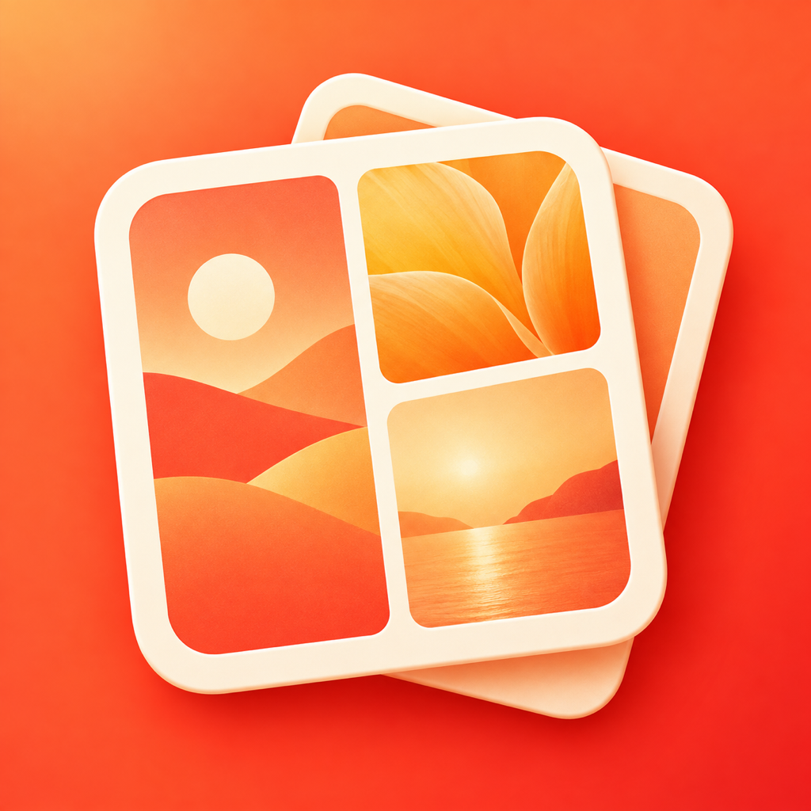
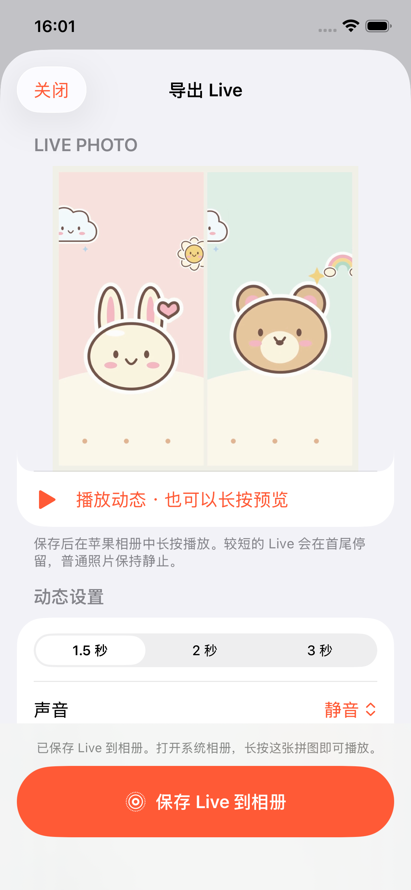

# 极拼 JiPin



把多张照片拼在一起，也让 Live Photo 的回忆一起动起来。

极拼是一款面向 iPhone 的本地拼图 App，支持模板、自由拼图、海报和横竖长图，以及原生 Live Photo 混合拼图。使用 Swift / SwiftUI 开发，最低支持 **iOS 17**。

**当前版本：4.0.12（构建 16）** · [快速开始](#快速开始) · [构建与签名](docs/BUILD.md) · [测试记录](docs/TEST-RECORD.md) · [已知边界](docs/KNOWN-ISSUES.md)

## 功能

| 拼图模式 | 照片数量 | 主要用途 |
| --- | --- | --- |
| 模板拼图 | 2–16 张 | 网格、分屏、少裁切布局推荐与分隔线调整 |
| 自由拼图 | 1–16 张 | 自由摆放、叠放照片，搭配文字和装饰 |
| 海报拼图 | 1–9 张 | 主题版式、标题与多图海报 |
| 长图拼接 | 2–20 张 | 横向、纵向拼接及静态分页导出 |

四种模式共用裁切、缩放、旋转、翻转、滤镜、调色、背景、边框、文字、贴纸、涂鸦、马赛克和图层编辑；支持最多 50 步撤销/重做、多份草稿与跨模式复制。

- **布局与风格**：46 个布局、23 个海报模板、9 套风格搭配；可收藏布局并保存个人风格。
- **贴纸与边框**：84 个贴纸，包含 16 个原创可爱贴图、8 个酷感贴图，以及 6 款画布装饰边框。贴纸册支持分类、搜索和收藏。
- **静态导出**：JPEG / PNG、标准与高清尺寸、相册保存、系统分享和存储到文件；自由与海报模式支持透明 PNG，长图支持分页。
- **草稿**：自动保存、重命名、复制、删除；图片和动态资源按引用共享，保存失败时保留已有草稿。

### 4.0.12 首页入口顺序

首页将证件照卡片放在贴纸试贴卡片上方，优先展示实际制作入口。详见 [4.0.12 发布说明](docs/v4.0.12-release.md)。

### 4.0.11 按网站要求自定义

「按网站要求自定义」入口位于通用模板上方，可填写名称、精确宽高和可选文件上限。提供 285×385 px／小于 1 MB 的快捷填写；高清和压缩都保持自定义像素。设定文件上限后优先满足上限，无法满足时明确提示。规格和上限随草稿保存，换照片时也会沿用。

网站禁止修饰时，应使用符合条件的原片，并选择「保留原背景并关闭轻修」。这里只处理照片文件，不能确认是否满足近期、免冠或其他报名条件。详见 [4.0.11 发布说明](docs/v4.0.11-release.md)。

### 4.0.10 证件照尺寸提示

编辑页、尺寸卡片和保存页显示所选高清／压缩对应的实际像素与 ppi；切换、撤销和草稿重开后同步更新。选尺寸前或编辑时可打开「尺寸对比」，按同一比例查看一寸和二寸的大小，了解屏幕预览与打印规格的区别。实际裁切与导出尺寸沿用 4.0.9，详见 [4.0.10 发布说明](docs/v4.0.10-release.md)。

### 4.0.9 证件照高清与草稿

首页「证件照」提供五个常用尺寸与自定义像素。导入单人人像，在本机切换白、红、蓝、蓝白渐变、浅灰底色，调整亮度／轻磨皮／色温，并可手动修边。轻修默认关闭，支持原图对比、50 步撤销及独立草稿。

证件照默认高清导出：五个固定模板按标准像素的 4 倍宽高从原图生成，压缩版保留标准尺寸；一寸照分别为 1180×1652 与 295×413 px。像素与 ppi 同比例提高，打印规格不变；自定义像素两档均保持输入尺寸。草稿同时显示在首页「草稿」页和证件照工具内，已有草稿无需迁移即可继续编辑。保存成功后关闭导出窗口。多人及无法识别人像时可保留原底调整尺寸，正式用途遵循办理方要求。

高清与草稿修复见 [4.0.9 发布说明](docs/v4.0.9-release.md)，原版范围见 [4.0.8 证件照记录](docs/v4.0.8-id-photo.md)，设计依据见 [证件照项目开发书](docs/id-photo-project-plan.md)。

### 4.0.6 长图清晰度与尺寸提示

Live 照片封面从原照片按完整静态尺寸合成，长图动态最长边提高至标准 1920 / 高清 3840，并受约 419 万像素上限保护。照片和动态尺寸分别显示；顶部 LIVE 标记与照片尺寸自适应排列，导出返回后也不会重叠。详情见 [4.0.6 发布说明](docs/v4.0.6-release.md)。

### 4.0.5 Live 预览刷新

Live 预览中更改时长、声音或清晰度后会自动重新生成；连续变化以最后一次选择为准。关闭、重开、撤销和手动生成继续可用。修复旧任务取消时的状态覆盖与导出锁交接，详情见 [4.0.5 发布说明](docs/v4.0.5-release.md)。

### 4.0.4 高清默认与保存收尾

新建拼图默认使用高清：普通静态拼图最长边 4096、长图基准宽度 1440、Live 最长边 1440。静态与 Live 使用同一份项目清晰度设置；用户手动选择标准或打开已有草稿时，保留已保存的选择。

相册确认保存成功后，导出窗口自动关闭并返回编辑器，包括普通图片、Live、从 Live 导出的静态图片及长图分页。保存失败或拒绝权限时保留窗口与重试提示。

详细变更与验证见 [4.0.4 发布说明](docs/v4.0.4-release.md)。

### 4.0.3 长图滑动修复

纵向和横向长图可以直接在照片上单指滑动浏览，不必去拖侧边滚动条。双指仍可平移、缩放、旋转照片，长按后拖动仍可交换照片；文字、贴纸和画笔保持原有操作。浏览不修改照片、不增加撤销记录，也不会自动切换工具面板。Live 长图使用同一套操作。

详细变更与验证见 [4.0.3 发布说明](docs/v4.0.3-release.md)。

### 4.0.2 体验更新

选图后先看真实照片的成品预览，再选择模式；普通导出的保存按钮固定在底部。编辑器补齐菜单文字，新增全部工具入口、字号/行距说明和直接套用风格。动态示例随安装包提供，先用轻量预览看效果，保存及分享时生成 1080 / 1440 成品。新增「周末出走」「毛孩子日记」「城市刊物」海报及六个原创酷感贴图。

详细变更和验证见 [4.0.2 发布说明](docs/v4.0.2-release.md)。

### Live Photo 拼图

从系统选择器选入 Live Photo，保留照片和动态视频，与普通照片混排后生成 **原生 Live Photo**。保存到苹果相册后可长按播放。

| 项目 | 支持范围 |
| --- | --- |
| 动态来源 | 每份作品最多 9 个不同 Live 来源，总照片数仍受所选模式限制 |
| 时长 | 1.5 / 2 / 3 秒；短片段在首尾保持画面，普通照片保持静止 |
| 声音 | 默认静音，可保留其中一张 Live 的原声 |
| 输出 | 照片封面保留完整静态尺寸；动态长图最长边 1920 / 3840，其他模式 1080 / 1440；30 fps，SDR JPEG + H.264 MOV |
| 编辑效果 | 沿用布局、裁切、旋转、滤镜、文字、贴纸和边框 |
| 其他输出 | 可选择静态图片导出，或以 MOV 视频进行分享 |

动态资源随草稿保存，重开、复制和撤销后仍能继续编辑。生成结果会先通过苹果 PhotoKit 的原生加载检查，再提供保存。技术方案见 [V4 Live Photo 方案](docs/v4-live-photo-plan.md)。

### 手势与精细调整

4.0.1 改进了画布操作：

- 模板、自由和海报模式中，拖动调整照片位置或格内画面；长图模式中单指滑动浏览，双指调整照片。双指围绕触点中心缩放和旋转。
- 增减手指时保持当前位置；一次手势对应一次撤销和保存。
- **长按约半秒后拖动**，将照片与另一格交换。
- 在「调整」中使用 ±1°、±5% 微调和构图复位。
- 操作时复用图片缓存，持续显示预览，暂停推荐缩略图刷新和自动保存；松手后恢复高清预览并保存。

### 从系统相册进入

在苹果「照片」中多选 **2–9 张**，点击分享，在操作区选择「极拼」，即可使用 Action Extension 快速拼图。

扩展支持模板、横竖拼接、排序、裁切、背景和间距。选择「保存草稿」后，可回主 App 的草稿页继续完整编辑。扩展收到完整 Live 资源时会保留动态草稿，**Live 合成与导出在主 App 完成**；扩展内直接保存/分享图片输出静态图。

## 界面与素材

以下为仓库内使用原创示例素材的功能截图：

<p>
  
  
</p>

[贴图总览](docs/design-source/originals/v3-sticker-board.png) · [边框总览](docs/design-source/originals/v3-frame-board.png) · [素材来源与授权记录](docs/asset-license.md)

## 快速开始

### 环境

- macOS 与完整 Xcode；本项目已在 Xcode 26.3、iOS 26.3 模拟器上验证。
- Xcode 中安装可用的 iOS 模拟器运行时。
- [XcodeGen](https://github.com/yonaskolb/XcodeGen)，用于从 `project.yml` 生成工程。

```sh
git clone https://github.com/lzbaclz/JiPin_iphone.git
cd JiPin_iphone

# 使用 Homebrew 安装工程生成工具
brew install xcodegen

# 若 Xcode 安装在其他位置，按实际路径修改
export DEVELOPER_DIR=/Applications/Xcode.app/Contents/Developer
xcodegen generate
open JiPin.xcodeproj
```

在 Xcode 中选择 **JiPin** scheme 和一个 iPhone 模拟器，运行 App。首页可直接选择「用示例插画体验」或「试试动态示例」，无需准备个人照片。

`project.yml` 是工程配置源。调整版本号、Target、签名和能力后，重新运行 `xcodegen generate`。

### 命令行构建与测试

以下命令在仓库根目录执行。设备名称以 `xcrun simctl list devices available` 的结果为准。

```sh
export DEVELOPER_DIR=/Applications/Xcode.app/Contents/Developer

# 模拟器构建
xcodebuild build -project JiPin.xcodeproj -scheme JiPin \
  -destination 'platform=iOS Simulator,name=iPhone 17' \
  CODE_SIGNING_ALLOWED=NO

# 核心测试
xcodebuild test -project JiPin.xcodeproj -scheme JiPin \
  -destination 'platform=iOS Simulator,name=iPhone 17' \
  -parallel-testing-enabled NO CODE_SIGNING_ALLOWED=NO \
  -only-testing:JiPinTests

# 界面测试
xcodebuild test -project JiPin.xcodeproj -scheme JiPin \
  -destination 'platform=iOS Simulator,name=iPhone 17' \
  -parallel-testing-enabled NO CODE_SIGNING_ALLOWED=NO \
  -only-testing:JiPinUITests
```

核心与界面自动化测试涵盖布局、导出、草稿、Live、手势、异常与兼容性。4.0.6 回归覆盖 78 个不同用例（全部通过），包含完整像素与细节、原生相册保存后回读，以及两种屏幕尺寸的布局验证。原生相册保存后回读的专项需要额外测试图库授权，常规运行可能跳过；启用方法及分轮验证结果见 [构建说明](docs/BUILD.md) 和 [测试记录](docs/TEST-RECORD.md)。

常用开发启动参数可配置到 Xcode scheme 的 **Arguments Passed On Launch**：

| 参数 | 用途 |
| --- | --- |
| `-sampleEditor -sampleMode template -sampleLayout g4-grid` | 打开四分格示例，复现缩放与旋转场景 |
| `-sampleEditor -sampleMode freeform` | 打开自由拼图示例 |
| `-sampleLiveEditor` | 打开可编辑的 Live 示例 |
| `-quickCollage` / `-quickLiveCollage` | 演示扩展快拼或 Live 草稿交接界面 |

## 真机与 TestFlight

工程预设了本项目的开发团队、Bundle ID 和 App Group。使用其他开发者账号时，需要同步配置 `project.yml`、核心模块中的 `JiPin.appGroupID` 和 `scripts/ExportOptions-TestFlight.plist`。主 App 与扩展使用同一团队，并配置相同的 App Group。

签名准备完成后，运行：

```sh
./scripts/archive-testflight.sh
```

默认产物位于 `build/TestFlight/<时间>/`：

```text
JiPin.xcarchive
Export/JiPin.ipa
```

该脚本完成本地签名归档和 IPA 导出。之后通过 Xcode Organizer 或 Transporter 上传，并在 App Store Connect 的 TestFlight 中配置构建和测试组。

4.0.2（6）的本机签名产物位于 `build/TestFlight/JiPin-4.0.2-6/`。构建产物被 Git 忽略，新克隆的仓库需自行构建。设备登记、签名故障及真实相册扩展验收步骤见 [构建与签名说明](docs/BUILD.md)。

## 项目结构

```text
Apps/
  JiPin/                  主 App、完整编辑器、导出和示例素材
  JiPinAction/            系统相册操作扩展与快拼界面
  JiPinUITests/           用户流程与手势测试
Packages/
  JiPinCore/              Swift Package：模型、布局、渲染、Live、草稿与核心测试
scripts/                  工程素材导出、截图与签名归档脚本
docs/                     方案、竞品研究、构建说明、验证记录与素材清单
project.yml               XcodeGen 工程配置
```

主要使用 SwiftUI / UIKit 构建界面与交互，PhotosUI / PhotoKit 处理选图和相册，AVFoundation 处理动态视频，Core Image / Core Graphics / ImageIO 处理图像。

## 数据与当前边界

核心编辑在本机完成，不接入账号、广告或第三方行为分析；照片导入完成后可离线编辑。系统选图只读取用户选择的项目，保存时申请添加照片权限。

静态工作图会去除元数据；Live 的本机动态工作副本可能包含原始元数据和声音，生成的成品不继承 GPS。草稿与工作副本排除云备份，清理导出缓存保留草稿和相册成品。iCloud 原图下载与用户主动分享由相应系统服务处理。

当前 Live 输出采用 SDR，不提供 HDR 保真、GIF、通用视频导入或动态壁纸功能。真实 iCloud 场景、系统相册宿主、低内存设备与连续操作性能仍需真机验收；模拟器的测试耗时不代表实际 iPhone 帧率。具体边界见 [待验证事项](docs/KNOWN-ISSUES.md)，草稿存储与兼容性见 [草稿格式](docs/draft-format.md)。

## 版本演进

| 版本 | 主要变化 |
| --- | --- |
| V1.0 | 四种拼图模式、完整编辑器、相册扩展与草稿 |
| V2.0 | 布局推荐、可调分隔线、个人风格和长图分页 |
| V3.0 | 原创可爱/酷感贴图、贴纸册与装饰边框 |
| V4.0 | 原生 Live Photo 导入、混拼、预览、导出和动态草稿 |
| V4.0.1 | 手势焦点与撤销修复、预览性能优化、微调和复位 |
| V4.0.2 | 实图模式预览、固定保存、编辑说明、轻量 Live 预览与新增海报贴图 |
| V4.0.3 | 长图直接滑动、浏览与编辑手势分工、工具面板稳定 |
| V4.0.4 | 默认高清、静态与 Live 清晰度统一、保存成功回到编辑器 |
| V4.0.5 | Live 设置自动刷新、连续切换与取消任务状态修复 |
| V4.0.6 | Live 原图清晰封面、长图动态提质、尺寸提示和标记布局修复 |
| V4.0.7 | 长图中在当前可见位置添加贴图 |
| V4.0.8 | 证件照工具、避免预选拼图模式后的重复选择 |
| V4.0.9 | 证件照默认高清与可选压缩、统一草稿箱、固定保存按钮 |
| V4.0.10 | 证件照实际输出提示、同一比例的尺寸对比 |
| V4.0.11 | 网站自定义名称与精确尺寸、文件上限、原背景选项 |
| V4.0.12 | 首页优先展示证件照入口 |

## 项目文档

- [最初项目计划](docs/iphone-photo-collage-project-plan.md)
- [拼图产品研究与取舍](docs/research/collage-market-review.md)
- [V4 Live Photo 方案](docs/v4-live-photo-plan.md)
- [构建、签名与测试](docs/BUILD.md)
- [本机验证记录](docs/TEST-RECORD.md)
- [已知边界与待验证项](docs/KNOWN-ISSUES.md)
- [草稿格式与版本兼容](docs/draft-format.md)
- [素材来源](docs/asset-license.md)与[设计目录](docs/design-source/catalog.json)
- [App Store 文案与审核说明](docs/store-listing.md)
