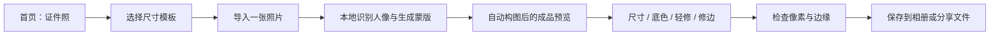

# 极拼证件照功能项目开发书

文档版本：1.0  
调研日期：2026-09-12  
建议产品版本：V4.1.0，作为功能更新；最终版本号在开发启动时确定  
评估基线：当前 `main`，提交 `77cc7ac`，App 4.0.7（构建 11），最低支持 iOS 17  
实施状态（2026-09-12）：已按本方案实现，并按用户后续要求与拼图模式入口修复合入 V4.0.8（构建 12），不单独发布 V4.1.0。实测结果与未完成的真机验收见 [4.0.8 证件照记录](v4.0.8-id-photo.md)。下文性能、质量比例和工期仍是立项时的拟定目标或估算，不代表实测结果。

## 1. 项目目标与本次决策

在极拼主 App 内增加一个独立、轻量的证件照工具。用户选择尺寸、导入一张照片，得到可以检查和微调的成品；可切换底色、轻微提亮或磨皮，最后按指定尺寸保存。

首版围绕三项需求交付：**常用尺寸模板、五种底色、自然轻修图**。用户不需要了解抠图、图层或分辨率换算，也不需要进入多图拼图编辑器才能完成证件照制作。

| 项目 | 首版方案 |
| --- | --- |
| 产品入口 | 首页增加「证件照」工具入口，保留现有拼图和 Live 主入口 |
| 模板 | 一寸、二寸、小一寸、小二寸、大一寸，共五个固定规格；附一个自定义像素入口 |
| 底色 | 白、红、蓝、蓝白渐变、浅灰，共五个预设 |
| 轻修图 | 亮度、轻磨皮、轻微色温修正；默认全部为 0 |
| 操作范围 | 单人、静态照片；导入后自动定位和等比裁切，允许人工微调 |
| 处理方式 | 优先使用 Apple Vision + Core Image，在本机处理 |
| 导出 | 默认高质量 JPEG，严格保持所选规格像素；提供相册保存和系统分享／存储到文件 |
| 可逆性 | 保留原图、原图对比、撤销／重做、重置、可恢复草稿 |
| 发布门槛 | 抠图边缘自然、切色跟手、输出规格准确、预览与导出一致 |

「蓝白」在本方案中具体解释为**上蓝下白的纵向渐变**；第五色选用浅灰。这两项属于产品方案选择，色值集中配置，后续更换不会影响核心架构。

## 2. 美图相关功能调研及取舍

### 2.1 调研范围与证据边界

本次核对了美图官方证件照介绍、美图出品的独立 iPhone 证件照 App，以及美图修图产品的官方商店说明。不同产品和平台分别记录，没有把桌面版功能直接视为美图秀秀 iPhone 主 App 的现成功能。

以下是公开功能说明研究，未对美图 App 进行付费操作或逐项真机测试；官方宣传中的速度、抠图精度和审核通过表述，不能作为极拼的实测指标。

| 研究对象 | 官方说明可确认的相关能力 | 对本项目的用途 |
| --- | --- | --- |
| 美图秀秀官方证件照介绍，桌面／网页产品入口 | 自动抠图与裁切、改尺寸、换底、美化、换装、排版照等 | 参考制作流程及功能分组，不复制完整产品规模 |
| 美图出品的独立「美图证件照」iPhone App | 按规格制作、自动裁切、多底色、文件大小及格式工具，另有写真和冲印服务 | 参考手机上的规格选择、成品检查和保存路径 |
| 美图修图产品的官方商店说明 | 磨皮、亮度／色温等图片调整，另有较强的人像改造能力 | 借鉴分项调节和自然质感的方向，限制本项目的修饰强度 |

来源：[美图官方证件照介绍](https://pc.meitu.com/id-photos)、[美图证件照 iPhone 官方商店页](https://apps.apple.com/cn/app/%E7%BE%8E%E5%9B%BE%E8%AF%81%E4%BB%B6%E7%85%A7-%E4%B8%80%E9%94%AE%E5%88%B6%E4%BD%9C%E6%A0%87%E5%87%86%E5%AF%B8%E7%85%A7-%E8%81%8C%E5%9C%BA%E5%86%99%E7%9C%9F-ai%E5%BD%A2%E8%B1%A1%E7%85%A7/id1584293308)、[美图桌面修图产品的官方商店说明](https://apps.apple.com/cn/app/%E7%BE%8E%E5%9B%BE%E7%A7%80%E7%A7%80-ai%E4%BF%AE%E5%9B%BE%E4%B8%8E%E8%AE%BE%E8%AE%A1%E5%B7%A5%E5%85%B7%E9%9B%86/id1588231633?mt=12)。

### 2.2 值得借鉴的方法

1. **先确定规格，再自动出一张可用的预览。** 用户关心最终需要什么照片，规格选择应先于复杂的编辑参数。
2. **把高频操作集中在一个页面。** 换颜色、改尺寸、轻修后可以立刻看到同一张照片的变化，减少来回跳转。
3. **始终展示输出信息。** 用户应知道即将保存的像素、格式和大致文件大小，避免到报名页面才发现不符。
4. **将美化拆成可关闭的独立参数。** 用户只换底时，不应被顺带提亮、磨皮或改变五官。

### 2.3 对抗式取舍：功能更多未必更好

| 容易采用的做法 | 可能产生的问题 | 极拼的决策 |
| --- | --- | --- |
| 首版就列上百个考试／证件名称 | 维护负担大，不同年份、地区和办理入口要求可能不同 | 首版按基础尺寸组织，明确显示毫米和像素；具体业务规格以后逐条核验 |
| 导入后立即自动美颜 | 已经修好的照片被重复处理，用户难以还原 | 默认参数为 0；「自然」配方需主动点击 |
| 只提供自动抠图 | 发丝、衣领和眼镜出错后，用户无法完成任务 | 首版保留放大检查、擦除／恢复修边 |
| 对整幅成品调亮度和磨皮 | 白底变灰、蓝底变色，衣服和眼睛失去细节 | 人像和背景分开处理；磨皮仅作用于保守的皮肤区域 |
| 每次换底重新识别人像 | 等待、卡顿，连续操作容易出现旧结果覆盖新结果 | 一次分割、多次复用；底色变化只触发合成 |
| 把固定像素照片一律导成 4096px「高清」 | 看似更清晰，实际违反上传尺寸要求 | 证件照使用独立导出规则，规格像素优先 |
| 增加换装、瘦脸、重绘、强美白 | 产品变重，也偏离本次自然轻修的要求 | 首版保持五官、脸型、发型和衣着，聚焦换底与轻修 |

这些取舍是对极拼的产品建议，不表示已经验证美图存在上述问题。

## 3. 目标用户、使用场景与范围

### 3.1 优先满足的任务

| 使用者的实际任务 | 对应能力 |
| --- | --- |
| 已有一张正面照，需要按通知提交一寸／二寸电子照 | 模板、自动构图、固定像素导出 |
| 同一张照片需要白底、红底或蓝底版本 | 一次抠图、反复切色和保存 |
| 人像稍暗，皮肤小范围粗糙，但希望仍然像本人 | 限幅亮度和轻磨皮 |
| 现有照片已经合适，只需要改尺寸 | 保留原背景，轻修为 0，等比裁切 |
| 换底后发丝或衣领有小缺口 | 局部修边、原图对比、撤销 |

### 3.2 首版范围

首版必须包含五个尺寸模板、五种底色、三项轻修控制、手动修边、高质量导出和可恢复草稿。模板和背景为本地内置数据，制作流程不需要账号。

相机拍摄、多人合照、结婚登记合影、服装替换、发型替换、生成式补脸、批量美颜、证件回执、纸质冲印、电商下单，以及 Live 视频逐帧换底不纳入首版。

导入 Live Photo 时，仅使用其静态照片，不读取或合成动态视频，并在此模块中输出静态证件照。原有 Live 拼图能力继续由原来的编辑器提供。

## 4. 大陆常用尺寸模板

### 4.1 固定规格

下表统一使用**宽 × 高**。像素由毫米尺寸按 300 ppi 换算并四舍五入，是本产品的基础输出预设；不是对所有考试、证件和办理机构要求的统一认证。

| ID | 显示名称 | 打印尺寸，mm | 默认像素，px | 名义比例 | 命名说明 |
| --- | --- | --- | --- | --- | --- |
| `id-25x35` | 一寸 · 25×35 mm | 25 × 35 | 295 × 413 | 25:35 | 首次进入时默认选中 |
| `id-35x49` | 二寸 · 35×49 mm | 35 × 49 | 413 × 579 | 35:49 | 常见二寸规格 |
| `id-22x32` | 小一寸 · 22×32 mm | 22 × 32 | 260 × 378 | 22:32 | 部分业务会直接称其为一寸，毫米必须保留 |
| `id-35x45` | 小二寸 · 35×45 mm | 35 × 45 | 413 × 531 | 35:45 | 小二寸常见规格之一 |
| `id-33x48` | 大一寸 · 33×48 mm | 33 × 48 | 390 × 567 | 33:48 | 部分通知也会使用小二寸名称，应以明确尺寸为准 |

规格依据与差异实例：

- 25×35 mm、295×413 px 可见于[宁夏财政厅发布的 2025 年资产评估师考试报名简章](https://czt.nx.gov.cn/xwzx/tzgg/202503/t20250328_4869058.html)。
- 35×49 mm 的二寸规格可见于[教育部教育考试院 DELF-DALF 照片要求](https://delf-dalf.neea.cn/xhtml1/report/2304/339-1.htm)。
- 22×32 mm 可见于[无锡公安发布的驾驶证照片说明](https://www.wuxi.gov.cn/doc/2025/05/23/4627485.shtml)，其文中称一寸，说明仅凭名称不够准确。
- 35×45 mm 的小二寸要求可见于[吉林大学经济学院 2026 年研究生录取材料通知](https://jjxy.jlu.edu.cn/info/1559/18630.htm)。
- 大一寸与 33×48 mm 的对应可见于[广东省因公赴港澳办证须知](https://www.gdhmo.gov.cn/bsdt/txzhqz/content/post_73689.html)。该较早文件用于核对名称，不作为当前办证规则库。

### 4.2 防止尺寸歧义

1. 模板卡片同时显示名称、毫米、像素；不只显示「一寸」或「小二寸」。
2. 尺寸数值作为稳定 ID 的依据，名称只是标签。检索别名命中多个规格时，展示多个带明确尺寸的结果，不能自动合并。
3. 宽、高分别存储；来源写的是高×宽时，在资料整理时转换并核对。
4. 对有矛盾的业务说明，不自行拼凑成「官方模板」；优先让用户按办理页面明确的像素要求自定义。
5. 首版不在基础模板上附加「某考试必过」「护照专用」等标识。

### 4.3 自定义像素

作为固定模板旁的次级入口，允许用户填写宽、高，范围暂定每边 100–2048px，总像素不超过 400 万。输入值须为正整数；编辑过程显示目标比例。

自定义像素由用户输入的数值直接决定，不能再用毫米反算后覆盖。300 ppi 只作为导出元数据默认值，显示的打印毫米数为推算参考。

### 4.4 换算规则

```text
px = roundHalfUp(mm / 25.4 × ppi)
mm ≈ px / ppi × 25.4
```

例如一寸在 300 ppi 下是 295×413px；若后续增加 600 ppi 留存版，须从毫米重新计算为 591×827px，不能简单将整数像素翻倍成 590×826px。

毫米换算到整数像素后，最终裁切以输出像素宽高比为准，避免通过独立拉伸宽高弥补四舍五入的差异。毫米和打印元数据允许对应的取整误差。

机构明确要求的像素、格式和文件大小应作为独立的业务规则，不能用基础毫米预设替代。日后增加具体业务模板时，需保存来源、适用地区／年度、核对日期和规则版本。

## 5. 五种背景预设

### 5.1 颜色定义

以下 RGB／HEX 是极拼的产品预设值，不宣称为全国统一的官方色号。正式编码及预览统一使用 sRGB。

| ID | 用户名称 | 类型 | 色值／渐变定义 | 使用说明 |
| --- | --- | --- | --- | --- |
| `white` | 白底 | 纯色 | `#FFFFFF`，RGB 255/255/255 | 首次制作默认值 |
| `red` | 红底 | 纯色 | `#D9363E`，RGB 217/54/62 | 常用红色预设 |
| `blue` | 蓝底 | 纯色 | `#438EDB`，RGB 67/142/219 | 常用蓝色预设 |
| `blue-white` | 蓝白渐变 | 纵向渐变 | 顶部 `#66A9E6` → 底部 `#FFFFFF` | 适合允许渐变背景的用途，界面标明「渐变」 |
| `light-gray` | 浅灰底 | 纯色 | `#E6E8EB`，RGB 230/232/235 | 简洁的个人资料／简历风格 |

蓝白渐变沿成品画布从上到下连续插值，固定在画布坐标中。移动人物或更换照片裁切时，渐变方向和位置保持稳定。

### 5.2 交互要求

- 颜色卡片同时有色块、文字和选中标记，不能只凭颜色区分；白色选项需要边框。
- 点击立即更新预览，保留裁切、轻修和人工修边结果。
- 提供「保留原背景」开关，供只改尺寸使用。这是处理模式，不计入五种预设色。
- 已经存在红／蓝底的人像，须检查发丝附近的原底残色；不能仅使用硬阈值把某一种颜色全部替换。
- 背景合成始终位于轻修之后，保证调亮、磨皮和色温不会改变预设底色。

### 5.3 可见边界

页面保留简短说明：「尺寸与底色请按用途要求选择，渐变底不适用于要求纯色背景的场景。」不在每次切色时弹窗打断操作。

## 6. 轻量修图：参数、默认值与上限

### 6.1 首版控制项

| 控制 | UI 范围 | 默认值 | 初始算法映射建议 | 作用范围 |
| --- | --- | --- | --- | --- |
| 亮度 | -20～+20 | 0 | 曝光偏移 `UI值 / 40`，即 -0.5～+0.5 EV | 人像前景，保持脸与颈部亮度关系 |
| 轻磨皮 | 0～30 | 0 | 保边平滑结果与原图混合，最高混合权重暂定 0.25 | 保守的面部皮肤区域 |
| 色温 | -10～+10 | 0 | 轻微冷暖校正，初始幅度相当于中性参考附近约 ±300K | 人像前景，降低偏黄／偏蓝观感 |

这些上限是开发调参起点，需要以真实样本验证，不能把 UI 数字当作跨算法统一的强度单位。实现应采用平滑映射，避免滑块低档位就出现明显变化。

用户主动点击「自然」时，可应用轻量配方：亮度 +5、磨皮 6、色温 0。配方每次设置固定参数，不能在现有结果上重复叠加；点击「重置轻修」准确回到 0/0/0。

### 6.2 自然质感约束

1. 导入照片不自动开启美颜，不根据用户性别或肤色选择不同的美化方案。
2. 保留脸型、五官位置、发型和衣着。没有瘦脸、大眼、鼻形修改和生成式补脸入口。
3. 磨皮不作用于眼睛、眉毛、嘴唇、鼻孔、头发、眼镜框和衣领。
4. 默认效果保留皮肤纹理，不能通过全图模糊实现磨皮；明显的痣、疤痕等特征不应被自动擦除。
5. 亮度调整结合高光保护，避免把额头和脸颊推成无细节的白块；色温调整保持原有肤色差异。
6. 所有参数为 0 时，轻修模块直接返回其输入，不暗中添加美白、锐化、降噪或滤镜。
7. 无可靠人脸区域时禁用自动磨皮并说明原因，仍允许用户调整尺寸和保留原背景。

### 6.3 对比与撤销

按住「对比原图」显示同一裁切位置的原始背景和未轻修人像，松开恢复当前成品，避免对比时跳动或改变缩放。

一次滑块拖动、一次裁切手势、一次修边笔画分别只记录一次撤销。切换参数页不改变效果；退出再打开草稿，参数与修边保持一致。

## 7. 用户流程与页面结构

### 7.1 默认流程



模板页默认突出一寸和二寸，其他三个规格仍可直接看到。选好模板后打开系统单张照片选择器；导入后直接进入成品页，默认白底、轻修为 0。

### 7.2 编辑页

| 区域 | 内容 |
| --- | --- |
| 顶栏 | 返回、撤销、重做、保存 |
| 中央 | 有明确边界的成品预览，可放大检查边缘 |
| 规格说明 | 如「一寸 · 25×35 mm · 295×413 px」 |
| 工具栏 | 尺寸、底色、轻修、修边 |
| 当前工具面板 | 只展示当前工具的选项，避免长菜单挤压预览 |
| 固定反馈区 | 处理状态、低清晰度提示、保存成功提示；不遮挡人脸 |

色板一屏显示五个选项。亮度／磨皮／色温有名称、数值、重置操作。修边模式中明确显示当前是「恢复人物」还是「擦除背景」，避免操作含义不明。

### 7.3 构图与手势

- 自动定位人像中心，提供头顶留白、肩部和中线辅助；默认构图参数是建议，不等同于各类证件的人像比例标准。
- 初始建议头顶留白约占画布高度 6%–10%，头部包含头发至下巴约占 60%–70%；原型中按样本校准。
- 人脸检测框不是完整头部框，不能直接拿脸框代替头顶到下巴；需结合人物蒙版和上方连通区域估计，并允许手动调整。
- 裁切保持等比缩放，不横向或纵向拉伸人物。提供平移、捏合缩放、微调和复位。
- 用户手动确认过构图后，换底和轻修不重置位置；改模板时尽量保留人物中心，显示新的裁切范围。
- 修边模式中单指绘制，双指缩放／平移；普通构图模式中单指平移。两种模式的说明和选中状态必须明确。
- 一次手势结束后再提交撤销记录及草稿，沿用已验证的编辑交互原则。

### 7.4 异常处理

| 情况 | 页面行为 |
| --- | --- |
| 用户取消选图 | 回到模板页，保留已选尺寸 |
| iCloud 原图需下载 | 展示系统读取状态，允许取消；不承诺此阶段离线 |
| 没有识别到正面人像 | 提示换用清晰正面照片；可继续仅做尺寸调整，自动磨皮不可用 |
| 检测到多张脸 | 提示选择单人照片或重新裁切出单人，再执行识别 |
| 抠图失败或请求不可用 | 保留照片和模板，提供重试／换图／仅改尺寸；不展示虚假的抠图成功 |
| 图像模糊、头顶已经缺失 | 明确提示原片限制，不能用生成式补全伪造缺失细节 |
| 连续导入 A、B 两张图 | 取消 A 的任务，只有 B 的结果可更新界面 |
| 保存权限被拒绝 | 保留编辑状态，提供设置说明及分享／存储到文件入口 |
| 磁盘空间不足或编码失败 | 保留草稿和重试入口，不能提前显示已保存 |
| 导出时修改参数 | 导出锁定点击保存时的快照；当前任务完成前禁用重复保存 |

## 8. 与当前工程的衔接

### 8.1 已有能力与新增工作

| 现有文件／模块 | 可复用部分 | 本次需要增加或调整的部分 |
| --- | --- | --- |
| `Apps/JiPin/Screens/HomeViews.swift` | 首页导航和工具入口组织 | 增加独立证件照入口及草稿导航 |
| `Apps/JiPin/PhotoImporter.swift` | 系统选图、文件接收、图片解码处理 | 单张静态导入路径；Live 仅获取静态照片 |
| `PhotoEffects.swift` | Core Image 使用方式、部分颜色调整基础 | 新建人像限定的轻修管线，不直接对合成后的整图套用现有调整 |
| `ImageIOHelpers`、`ExportFile` | 图片解码、元数据处理、编码和文件分享基础 | 精确尺寸、ppi、JPEG 品质和证件照文件命名 |
| 现有保存流程 | 相册追加权限、保存结果回调、成功后关闭导出页 | 接入证件照结果，继续保证失败不关闭、成功才提示 |
| 现有手势与撤销实现 | 手势事务、坐标变换、微调方式 | 人物裁切及蒙版笔画的专用交互 |
| 草稿基础设施 | 原子写入和失败保留旧版本的原则 | 独立证件照数据结构与目录，不改变旧拼图草稿的解释方式 |

当前仓库的 `PhotoEffects` 有亮度、对比度、饱和度和色温处理，但没有本功能所需的人像分割与局部磨皮。首版不能仅在现有调色面板加几个按钮就视为完成。

### 8.2 建议新增模块

以下名称为设计建议，不表示文件已经存在。

```text
Apps/JiPin/IDPhoto/
  IDPhotoEntryView.swift          模板选择与单图导入
  IDPhotoEditorView.swift         编辑页与工具面板
  IDPhotoCropView.swift           等比裁切、辅助线、微调
  IDPhotoMaskEditor.swift         擦除／恢复修边
  IDPhotoExportView.swift         输出信息、保存、分享

Packages/JiPinCore/Sources/JiPinCore/IDPhoto/
  IDPhotoProject.swift            参数、模板、背景、笔画模型
  IDPhotoTemplateCatalog.swift    五个规格与来源记录
  IDPhotoSegmentation.swift       人像蒙版和人脸关键点
  IDPhotoRetouchRenderer.swift    轻修、皮肤区域保护
  IDPhotoRenderer.swift           背景合成、裁切和统一渲染
  IDPhotoSession.swift            状态、任务取消、撤销
  IDPhotoDraftStore.swift         原子保存与恢复
  IDPhotoExport.swift             固定像素、编码、元数据
```

证件照具有单人、固定规格和蒙版编辑等特性，首版采用独立编辑会话。向现有 `CollageMode` 强行加入第五种模式会影响照片数量限制、跨模式复制和旧草稿兼容，不作为本次首选方案。

## 9. 图像处理技术方案

### 9.1 系统能力选择

优先评估 `VNGeneratePersonSegmentationRequest` 的高质量模式，用于人物蒙版；在原型阶段与 `VNGenerateForegroundInstanceMaskRequest` 比较边缘效果和复杂背景表现，确定一个默认策略，而不是每次都运行两套模型。人脸位置与五官保护区域由 `VNDetectFaceLandmarksRequest` 辅助。

Apple 说明了 Vision 主体分离及 Core Image 合成的组合方式，并指出图像分析应放在后台执行。[Apple 主体分离与合成](https://developer.apple.com/videos/play/wwdc2023/10176/)、[人像分割质量选项](https://developer.apple.com/documentation/vision/vngeneratepersonsegmentationrequest/qualitylevel-swift.enum)、[人脸关键点检测](https://developer.apple.com/documentation/vision/vndetectfacelandmarksrequest)。

**人物蒙版不是皮肤蒙版。** 首版需基于关键点构造保守的面部区域，并排除眼、眉、唇等保护区域；不能假定系统人物分割能直接提供精细肤质分类。

### 9.2 统一渲染顺序

```text
接收原片
  → 方向校正，建立唯一照片坐标空间
  → 生成受控尺寸的分析／预览图
  → 人物蒙版 + 人脸位置／关键点
  → 边缘细化、人工修边，得到最终人物 alpha
  → 原人像轻度提亮／色温修正
  → 在皮肤限定区混合保边平滑结果
  → 将处理后的人像与指定背景合成
  → 按同一裁切参数输出固定像素
  → sRGB、JPEG 编码与 ppi 元数据
```

保留原背景时跳过背景替换；轻修仍按前景／皮肤区域限制作用范围。导出从本地原始工作副本重新渲染，不对编辑界面截图，也不对低分辨率预览进行放大保存。

### 9.3 蒙版与发丝

- 保留浮点或足够精度的软边 alpha，不把所有边缘硬切成 0/1。
- 先验证系统高质量蒙版，再决定是否增加边缘保留滤波和边缘颜色净化；具体滤波实现由原型表现决定。
- 原底残色处理仅作用于边界带，不能侵入正常皮肤或改变整个发色。
- 在白、红、蓝三种高反差背景上都检查同一份蒙版，避免只在白底看起来正确。
- 对半透明眼镜边缘、碎发和浅色衣服保守处理，允许用户恢复被误删的区域。

### 9.4 轻磨皮

候选方案为小半径保边平滑，与原图按低权重混合。原型可比较 Core Image 已有降噪能力与必要的自定义滤波，但需要单独验证肤质效果，不能把普通高斯模糊作为最终磨皮实现。

预览与导出按图像尺度换算滤波半径，共用同一参数映射。皮肤区域边缘要柔和过渡，防止出现面具边界；对于不可靠的发际线和额头区域，优先保留原图。

## 10. 状态、缓存与性能

### 10.1 重计算规则

| 操作 | 重跑人物识别 | 重算人物轻修 | 重做合成／显示 |
| --- | --- | --- | --- |
| 换照片 | 是 | 是 | 是 |
| 切换五种底色 | 否 | 否 | 是 |
| 调亮度／色温／磨皮 | 否 | 是 | 是 |
| 改模板／平移／缩放 | 否，复用原片坐标中的蒙版 | 仅在输出工作尺度变化时需要 | 是 |
| 擦除／恢复一笔 | 否，修改蒙版 | 保护区域受影响时局部更新 | 是 |
| 查看原图 | 否 | 否 | 切换已有显示结果 |
| 导出 | 优先复用已确认蒙版，必要时按导出尺度细化 | 按导出尺度渲染 | 是 |

原片分析、导出和磁盘保存离开主线程。滑块、色板和手势更新只提交最新参数，过期任务不得覆盖新状态。每个任务携带照片标识及递增 revision，关闭页面或换图时取消；即便底层不能立即停止，也要丢弃过期结果。

### 10.2 坐标与内存

- 原图经方向归一化后，裁切框和笔画采用 0–1 照片坐标。
- 明确转换 Vision 坐标、UIKit 视图坐标、照片坐标，镜像与横竖图必须覆盖测试。
- 笔刷半径按可见图像尺度换算；放大后修边仍落在同一个人物位置。
- 大图先生成分析和预览代理，原片按需解码；预览工作长边建议 1024–1280px，分割分析输入上限在原型中比较 1536／2048px。
- 同时只运行一个高成本分割任务，不为五个底色分别持有整套人物位图。
- 限制撤销缓存容量，优先记录参数和笔画；不把 50 份全尺寸 RGBA 图像作为撤销历史。

### 10.3 拟定性能目标

基准：本地 12MP 单人人像、Release 构建；至少在一台较旧支持设备（建议 iPhone 12）和一台较新设备（建议 iPhone 15 Pro）上测量。记录实际 iOS 版本、冷启动／热启动、图片尺寸、耗时和峰值内存。iCloud 下载不计入本地处理时间。

| 项目 | 验收目标 |
| --- | --- |
| 本地图片导入至可见预览 | 常规样本 P95 ≤ 1.5 秒 |
| 自动分析至换底成品 | 较新机 P95 ≤ 4 秒，较旧机 P95 ≤ 6 秒；以原型结果校准 |
| 已有蒙版后的切色反馈 | P95 ≤ 100ms，连续切色不新增 Vision 请求 |
| 滑块与手势 | 持续交互以 ≥30fps 为最低目标，不因后台识别阻塞触摸 |
| 普通尺寸 JPEG 渲染编码 | P95 ≤ 3 秒；相册写入耗时另计 |
| 取消、换图、退出 | 页面可立即响应，过期任务不会重新弹出页面或覆盖新照片 |
| 反复制作 20 次 | 无持续增长的未释放位图／蒙版；在基准设备上无内存终止 |

性能目标需在 M0 原型阶段修订并写入测试记录。没有真机实测前，不对用户宣传「秒出图」或给出保证的抠图成功率。

## 11. 导出、高清和文件大小

### 11.1 默认保存规则

1. 默认 JPEG，初始编码品质建议 0.94；实际品质需以细节与文件大小验证。
2. 固定模板输出精确像素，例如一寸就是 295×413px；不套用普通拼图的最长边 4096px 规则。
3. 默认界面用「高质量保存」，同时显示像素与 300 ppi；避免把「高清」误解为随意放大尺寸。
4. 输出为不透明 sRGB；写入分辨率元数据，清除定位等非必要元数据。
5. 不覆盖原照片。保存前冻结当前参数快照，等待匹配该 revision 的结果再编码。
6. 相册确认写入成功后，关闭导出窗口并返回证件照编辑页，显示简短成功提示；失败时保留原页面和重试入口。
7. 原图有效像素不足时提示建议换用清晰原片，不能把插值放大宣传成细节恢复。

文件名示例：`极拼_一寸25x35_白底_295x413.jpg`，不自动包含姓名或证件号码。

### 11.2 文件大小

首版展示生成后的实际 KB 值，并支持分享／存储到文件。不同上传平台的文件大小限制不同，不给所有模板绑定一个通用上限。

按目标 KB 压缩列为 P1：在固定像素不变的前提下调整 JPEG 编码品质，并设置最低品质下限。无法同时满足尺寸、体积与质量时明确提示，不悄悄缩小像素，也不通过无意义填充伪造合格文件大小。

600 ppi 留存版、六寸相纸排版和批量导出也列为 P1，避免挤占首版抠图和自然轻修的验证投入。

## 12. 草稿、隐私与兼容

### 12.1 建议数据模型

| 字段组 | 内容 |
| --- | --- |
| 基础信息 | `schemaVersion`、`id`、名称、创建和更新时间 |
| 原片 | 本地不可变文件引用、指纹、像素尺寸、方向归一化信息 |
| 模板 | 稳定模板 ID、规格快照、自定义像素（可选） |
| 构图 | 原片归一化裁切参数、位置、缩放和旋转 |
| 背景 | 预设 ID、纯色／渐变参数快照、是否保留原底 |
| 轻修 | 亮度、磨皮、色温；算法及参数映射版本 |
| 蒙版 | 基础蒙版文件、坐标／尺寸信息、识别算法版本、人工笔画 |
| 导出 | JPEG 品质、像素、ppi、可选后续体积限制 |

### 12.2 保存策略

建议使用独立 `IDPhotoDrafts/{id}/` 目录保存 `project.json`、原片工作副本、蒙版、缩略图和完成标记。首版证件照原片不进入现有拼图 `SharedAssets` 回收范围，避免旧回收器遗漏新引用后误删素材。

采用先写暂存目录、成功后原子替换的方式；失败保留上一份完整草稿。裁切、轻修和修边结束后合并保存，退出时等待最新保存完成。普通清理缓存只清预览／导出临时数据，不能删除草稿原片和人工修边。

已确认的蒙版和算法版本随草稿保留，升级后不无提示地用新模型重写旧边缘。蒙版文件损坏时保留原片和参数，说明需要重新检查边缘后再导出。

### 12.3 权限与数据处理

- 采用系统照片选择器，只接收用户选中的单张照片。
- 沿用保存时申请相册追加权限的方式，首版不新增拍摄权限。
- 分割、轻修和合成在设备本机进行；iCloud 原片可能由系统联网下载，主动分享交给用户选择的目标 App。
- 不新增人脸识别账号、身份数据库或云端美颜服务。日志不写入照片、人脸关键点、姓名和证件号。
- 草稿延续现有排除云备份的原则，具体目录设置在开发时验证。
- 现有拼图草稿 schema 1–4、Live 资源和相册扩展不做强制迁移；回归验证照常执行。

## 13. 证件用途边界与提示

本工具提供尺寸调整、背景处理和轻修能力，不能代替办理机构的照片审查。尺寸一致只是其中一个条件，头部比例、拍摄时间、遮挡、背景、修图限制和指定审核工具也可能影响使用。

例如，中国驻孔敬总领馆的照片说明列明 33×48mm 等要求，并要求照片未经修改、不得使用合成照片；无锡公安的驾驶证说明同样包含人像技术处理和合成限制。[电子护照照片说明](https://khonkaen.china-consulate.gov.cn/lsgz/lszj/hz/hzlxzzpyq/202502/t20250223_11560680.htm)、[驾驶证照片说明](https://www.wuxi.gov.cn/doc/2025/05/23/4627485.shtml)。

因此，首版使用基础尺寸模板，轻修默认关闭，并提供保留原背景。页面说明保持简短：「用于正式证件或考试时，请以办理方的照片要求为准；部分用途不允许换底或美颜。」不宣称官方认证、自动获取回执或保证审核通过。

这里是产品边界，不把未经核验的证件规则写成阻断用户操作的自动合规系统。

## 14. 测试与验收

### 14.1 样本集

首轮建议准备 50 张经授权的测试照片：20 张清晰、构图完整的基础样本，20 张碎发／眼镜／浅衣服／复杂背景等挑战样本，10 张多人、无脸、缺失头顶、旋转、损坏或低分辨率等异常与控制样本。

样本覆盖不同肤色、发质和光照，不使用单一肤色阈值作为皮肤识别依据。真实证件照不默认提交公开仓库或随 App 分发；公开演示可使用虚构人像，真实照片验收仍须单独完成。

### 14.2 质量验收方法

- 同一有效样本至少检查白、红、蓝三底；渐变与浅灰检查边缘融合和背景颜色稳定性。
- 在实际导出尺寸及放大视图检查发丝、耳朵、眼镜、衣领，不能只看小缩略图。
- 基础样本自动结果的建议通过目标为至少 18/20；挑战样本允许修边，建议至少 16/20 能在约一分钟修边内达到可用效果。数值需在 M0 确认，不能作为对外成功率。
- 由至少两名检查者对照原片评估，记录具体缺陷，不只打「好看」分。
- 严重改变人物特征、明显缺失眼镜／耳朵、无法恢复衣领等问题阻止发布，不能靠自动美化掩盖。

### 14.3 功能验收矩阵

| 编号 | 检查项 | 通过条件 |
| --- | --- | --- |
| A01 | 五个模板 | 名称、宽高、300 ppi 像素和实际编码文件一致 |
| A02 | 自定义尺寸 | 按用户输入精确输出，非法值有说明且不能触发异常分配 |
| A03 | 五种底色 | 五项齐全、选中清楚、背景切换不重置构图和修边 |
| A04 | 背景颜色稳定 | 调亮／磨皮／色温不会改变人物之外的预设背景；JPEG 误差与合成错误分开判断 |
| A05 | 轻修零值 | 统一解码和色彩空间后，零值轻修不改变其输入；不把 JPEG 重编码误差误判为修图 |
| A06 | 自然上限 | 最大强度仍保留五官边缘和可见肤质，无明显塑料感 |
| A07 | 修边准确 | 放大、旋转、裁切后笔画位置正确；擦除／恢复、撤销／重做可用 |
| A08 | 手势 | 平移缩放跟手、没有跳位，一次手势对应一次撤销 |
| A09 | 快速连续操作 | 连续切色、拖滑块、换图时只有最新结果显示 |
| A10 | 取消与退出 | 取消后不出现迟到结果、重复弹窗或新旧图片串用 |
| A11 | 保存行为 | 成功后关闭导出页；权限拒绝、磁盘不足、编码失败时不显示成功 |
| A12 | 预览与导出 | 人物位置、裁切、背景、轻修一致；导出不含辅助线或 UI |
| A13 | 草稿恢复 | 重开和进程重启后参数／蒙版／笔画一致，失败写入不损坏旧草稿 |
| A14 | 输入兼容 | JPEG、PNG、HEIC、横竖方向及静态 Live 照片路径正确 |
| A15 | 异常人像 | 多人、无脸、头顶缺失等得到真实反馈，不冒充合格证件照 |
| A16 | 旧功能回归 | 拼图、Live、草稿、分享扩展、高清默认和保存自动收尾继续可用 |
| A17 | 隐私与清理 | 本机素材可离线处理；清缓存不删草稿；输出不携带定位信息 |
| A18 | 可访问性 | 小屏、大字体、VoiceOver、选中色名称和滑块数值可用 |

有意义的自动化覆盖包括尺寸换算和编码结果、坐标变换、零值效果、异步任务新旧交接、保存结果回调、草稿失败恢复。发丝观感和磨皮自然度同时需要人工样本检查，不以代码测试代替视觉验收。

## 15. 实施计划与工作量

按一名熟悉现有工程的 Swift 开发者估算，首版约 **15–23 个有效工作日，约 3–5 周**。包含开发、自测和修正，不包含 Apple 审核等待；分割与磨皮样本表现是最大的工期变量。

| 阶段 | 预估 | 工作内容 | 阶段交付／进入下一阶段条件 |
| --- | --- | --- | --- |
| M0 可行性原型 | 2–3 天 | 真实样本、两类系统分割方案比较、保守皮肤区域与性能测量 | 明确默认算法、支持范围、质量缺口与修订后的性能目标 |
| M1 模板与导入 | 2–3 天 | 首页入口、五规格、自定义像素、单图读取、裁切框架 | 正常选图到预览闭环，尺寸计算准确 |
| M2 换底与修边 | 4–6 天 | 蒙版细化、五色、保留原底、修边和撤销 | 基础／挑战样本达到已确认门槛，切色不重跑分割 |
| M3 自然轻修 | 2–3 天 | 三项限幅参数、自然配方、区域保护、对比与复位 | 零值准确还原，最大强度不过度，背景不被误调 |
| M4 保存与草稿 | 2–3 天 | 精确像素编码、ppi、相册／分享、独立草稿 | 成功和失败路径清楚，重启恢复正确 |
| M5 回归与内测 | 3–5 天 | 真机质量、性能、大字体、原有功能回归、发布资料 | A01–A18 完成，严重问题归零 |

M0 若证明系统分割在目标样本上明显达不到要求，应先明确可接受输入和需要的改进，再调整后续工作量。不能用未验证的云端服务替代本地方案后直接发布。

### 15.1 Git 与版本交付

- 开工时从最新稳定 `main` 建立 `codex/id-photo-v4-1` 开发分支，核实其他正在进行的改动。
- 每个完成并验证的阶段提交一次有意义的变更，沿用中文提交说明，例如 `feat(ios): 增加证件照模板与单张导入`、`feat(ios): 增加证件照五色换底与轻修`。
- 完整功能版本通过验收后，更新 README、使用说明、测试记录、素材授权记录与隐私说明中受影响的内容，再合并到 `main`。
- App 和扩展的版本保持一致；构建号从 App Store Connect 当前最大值继续递增，不在本方案中预占。
- Archive、签名验证、上传 TestFlight 和公开外测状态分别核实，不把「上传成功」写成「外测已通过」。

### 15.2 交付清单

| 交付物 | 内容 |
| --- | --- |
| 功能源码 | 模板、蒙版、轻修、修边、渲染、保存和草稿 |
| 内置配置 | 五个尺寸模板、五种背景、参数范围及算法版本 |
| 测试记录 | 样本范围、质量缺陷、设备／系统、耗时和回归结果 |
| 文档 | 操作说明、输出尺寸说明、适用边界、已知限制 |
| 发版材料 | 新功能真实截图、真机流程演示、TestFlight 测试说明 |
| 版本记录 | 已验证提交、发布标签、构建号与分发结果 |

## 16. 后续候选与本次完成定义

P1 候选包括按目标 KB 压缩、600 ppi 留存、六寸相纸排版、保存五种底色的批量版本，以及将人像抠图复用于人物贴纸。具体考试／证件的业务模板另行维护来源和适用范围，不由普通尺寸模板自动推导。

首版完成的定义是：用户可以独立完成「选五个尺寸之一 → 导入单人照片 → 在五色中选择 → 可选自然轻修／修边 → 按指定像素保存」，并且原片不被覆盖、复杂输入有真实反馈、旧拼图能力不受影响。

## 17. 资料与决策维护

本方案引用的产品资料截至 2026-09-12。机构通知用于证明尺寸与命名差异，不能替代用户办理时的新要求。开发开始前再次核对系统 API、现有工程版本和拟对外显示的模板信息。

| 资料 | 核对内容 |
| --- | --- |
| [美图官方证件照页面](https://pc.meitu.com/id-photos) | 规格、换底、裁切、美化等公开功能流程 |
| 美图证件照 iPhone 商店页，见第 2 节 | 手机专用产品的公开功能，区别于桌面版 |
| [Apple 主体分离与合成](https://developer.apple.com/videos/play/wwdc2023/10176/) | Vision、蒙版、Core Image 合成和后台处理 |
| [Apple 人脸关键点](https://developer.apple.com/documentation/vision/vndetectfacelandmarksrequest) | 人脸位置、五官保护辅助 |
| [Apple Core Image](https://developer.apple.com/documentation/coreimage) | 图片处理、合成及自定义滤波基础 |
| [宁夏财政厅考试通知](https://czt.nx.gov.cn/xwzx/tzgg/202503/t20250328_4869058.html) | 25×35 mm 与 295×413 px 的实例 |
| [教育考试院 DELF-DALF 照片要求](https://delf-dalf.neea.cn/xhtml1/report/2304/339-1.htm) | 35×49 mm 二寸实例 |
| [吉林大学 2026 年通知](https://jjxy.jlu.edu.cn/info/1559/18630.htm) | 35×45 mm 小二寸实例 |
| [无锡公安驾驶证照片说明](https://www.wuxi.gov.cn/doc/2025/05/23/4627485.shtml) | 22×32 mm、照片处理限制 |
| [广东省因公赴港澳办证须知](https://www.gdhmo.gov.cn/bsdt/txzhqz/content/post_73689.html) | 大一寸名称与 33×48 mm 的历史实例 |
| [驻孔敬总领馆照片说明](https://khonkaen.china-consulate.gov.cn/lsgz/lszj/hz/hzlxzzpyq/202502/t20250223_11560680.htm) | 官方证件的尺寸与修图限制实例 |

本方案将「已核对的公开事实」「极拼的产品选择」「等待原型验证的目标」分别标明。五色、默认轻修参数和算法阈值属于极拼自身设计，不能标成美图参数或官方证件标准。
