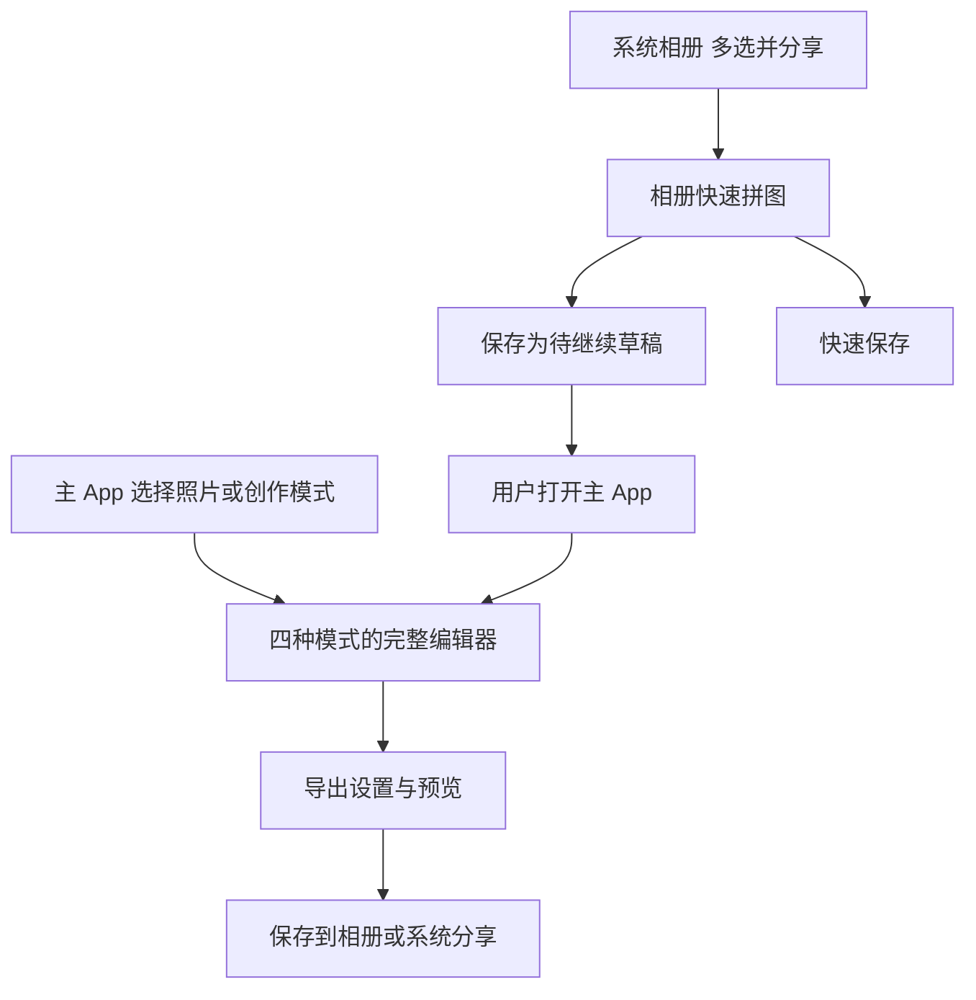

# iPhone 多功能拼图 App 项目计划书

> 迭代说明（2026-09-10）：首版之后的工作按 V2.0（效率与导出）和 V3.0（原创装饰素材）推进，新增范围和取舍见 [竞品研究与版本决策](research/collage-market-review.md)。下文首版预算、工期和 V1.1/V1.2 路线保留为历史规划，不代表当前剩余工作量。

产品暂名：极拼 JiPin

版本：2.0

更新日期：2026 年 9 月 9 日

产品定位：面向 iPhone 用户，提供多种拼图模式、照片与装饰编辑、高清导出，并支持从系统相册进入快速拼图。

## 一 产品目标与参考范围

本项目开发一个第三方 iPhone App，重点建设类似美图秀秀拼图模块的创作体验：用户选好照片后，可以套用布局、自由摆放、制作海报或拼接长图，继续添加文字、贴纸、背景和图片效果，最后保存到相册或分享。

美图秀秀的 iOS 官方介绍列出了风格模板、横竖切换、无缝拼接、自定义布局及截图智能拼接等能力，其图片编辑工具还包括文字、贴纸、边框、马赛克和涂鸦。以下功能划分、素材数量和版本优先级是极拼的产品设计，不表示与美图秀秀当前版本逐项对应。[美图秀秀 iOS 官方介绍](https://apps.apple.com/cn/app/id416048305)

**首版应交付四种拼图模式、共用编辑工具、素材库、多份草稿、保存分享及相册快速入口。** 人像美颜、拍照相机、视频剪辑和生成式 AI 不属于本项目首版范围。模板、图标和素材采用自己的设计或取得授权的资源。

### 用户需要完成的典型任务

| 场景 | 用户目标 | 对应能力 |
| --- | --- | --- |
| 旅行与生活记录 | 把多张照片排得整齐，再加地点和日期 | 模板拼图、文字、统一滤镜 |
| 手账与创意拼贴 | 让照片重叠、倾斜，加入贴纸和装饰 | 自由拼图、图层、背景、涂鸦 |
| 封面与活动宣传 | 套用带标题和装饰的完整版式 | 海报拼图、可替换照片位、文字样式 |
| 商品与前后对比 | 并排展示细节，补充标签和箭头 | 分屏模板、裁切、标注 |
| 聊天记录与截图整理 | 按顺序拼成长图，并手动遮挡信息 | 长图拼接、逐图裁切、马赛克或色块 |

首周用 5–8 人的流程试用确认常用模式和工具顺序。上述功能数量、照片上限与性能指标均为规划值，需通过原型和真机样例确认；不把它们描述为已经实现的能力。

## 二 产品入口与系统相册的关系

用户先安装极拼 App。App 提供完整编辑器，并随安装包提供操作扩展，让用户从系统相册的分享菜单调用快速拼图。Apple 要求这类扩展由一个 App 承载和分发。[Apple 扩展机制](https://developer.apple.com/library/archive/documentation/General/Conceptual/ExtensibilityPG/index.html)

| 入口 | 首版提供的能力 | 操作路径 |
| --- | --- | --- |
| 极拼主 App | 四种模式及全部首版编辑工具 | 打开 App → 选模式或照片 → 编辑 → 导出 |
| 系统相册操作扩展 | 2–9 张照片的模板、横竖拼接、排序、裁切、背景和间距调整、保存 | 照片多选 → 分享 → 极拼 → 快速编辑 → 保存 |
| 从相册继续完整编辑 | 将所选照片和当前编辑保存为待继续草稿 | 扩展保存草稿 → 用户打开极拼 → 继续编辑 |

**相册入口纳入首版。** 自由摆放、完整文字与贴纸工具、复杂海报及超过 9 张的编辑在主 App 中完成。扩展内明确显示可用功能；保存草稿后说明继续编辑的方法，不以扩展能够自动跳转到主 App 作为交付前提。

扩展出现在系统分享菜单的操作区域，不能将其宣传为修改了苹果相册的原生工具栏。入口是否显示与选中内容、激活规则和用户配置有关；首版扩展只声明支持 2–9 张图片的快速流程，其他数量使用主 App 导入。[Apple 操作扩展说明](https://developer.apple.com/library/archive/documentation/General/Conceptual/ExtensibilityPG/Action.html)

## 三 拼图模式与版本范围

以下四种模式全部列入首版 V1.0。先开发哪些模块由第十一节的实施顺序决定，不将完成基础网格视为完整首版交付。

| 模式 | 主 App 照片数量 | 核心操作 | 首版完成标准 |
| --- | --- | --- | --- |
| 模板拼图 | 2–16 张 | 选择网格或分屏布局、交换照片、裁切、调整比例与边框 | 至少 30 个基础布局，覆盖所有支持的照片数量 |
| 自由拼图 | 1–16 张 | 自由移动、缩放、旋转、重叠、调整层级与对齐 | 照片及装饰能独立编辑，支持吸附、锁定与撤销 |
| 海报拼图 | 1–9 张，按模板照片位数量匹配 | 套用主题版式、替换照片、修改标题、背景和装饰 | 至少 20 套原创或授权模板，主要内容保持可编辑 |
| 长图拼接 | 2–20 张 | 横拼、竖拼、调整顺序、逐图裁切、无缝或留缝 | 按比例拼接，不自动删除或重复内容，输出尺寸清楚可见 |

### 模板拼图

- 按照片数量筛选可用布局；提供等分网格、主图加小图、横竖分屏等结构。
- 画布比例支持 1:1、3:4、4:3、9:16、16:9；格子随画布重新计算。
- 格内支持移动、缩放、旋转图片内容，以及“铺满裁切”或“完整显示”。格子的位置由模板控制。
- 支持拖动交换照片、单张替换、增加或删除照片；照片数量变化后重新展示匹配模板。
- 无缝效果表示间距与外边距为零，不等于识别并删除重复截图区域。
- 首版固定模板的格子结构；任意拖动分隔线、添加不规则格子作为后续增强。

### 自由拼图

- 每张照片作为独立对象，支持移动、缩放、旋转、翻转、透明度、圆角、描边和阴影。
- 提供上移一层、下移一层、置顶、置底、锁定、隐藏、复制和删除。
- 显示画布中心线、边缘及对象对齐参考线；接近对齐位置时可吸附，并允许关闭。
- 支持照片与文字、贴纸叠放；锁定对象不响应画布拖动，可从图层面板解锁。
- 首版采用逐个对象编辑；多选编组、批量等距分布和复杂混合模式留待后续。

### 海报拼图

- 首批主题覆盖旅行、日常记录、生日、节日、商品展示和社交封面。
- 每套模板定义照片位数量、画布比例、可编辑文字、装饰与背景；不以一张不可编辑的整图充当模板。
- 替换照片保留原照片位的样式；修改文字时支持换行和尺寸调整，不静默截断长文本。
- 默认使用设计好的比例；只有提供了对应版式的模板才开放比例切换，避免简单拉伸导致排版变形。
- 用户导入数量与照片位不匹配时，提供换模板或明确选择照片的步骤，不静默丢弃多余照片。

### 长图拼接

- 支持横向、纵向两种方向；纵向统一宽度，横向统一高度，其余尺寸按原图比例计算。
- 允许裁掉单张图片的顶部、底部或两侧，手动去除状态栏、空白和重复区域。
- 支持照片排序、间距、背景及文字标注；长画布可缩放查看，提供实际输出尺寸。
- 首版采用用户指定的顺序与裁切范围。自动识别重叠截图、自动去重和台词区域识别进入 V1.1 的独立验证。

## 四 共用编辑工具

这些工具围绕拼图制作提供，不要求用户导出图片后再进入另一个修图流程。工具栏随当前选中的照片、文字、贴纸或画布切换。

| 工具 | 首版功能 | 作用范围与规则 |
| --- | --- | --- |
| 照片调整 | 裁切、旋转、翻转、移动、缩放、替换 | 调整原图的显示参数，保留原始素材 |
| 画布与背景 | 常用比例、纯色、双色渐变、纹理、用户选图作背景 | 自由模式可自定义比例；海报按模板支持的比例切换 |
| 边框与装饰 | 间距、外边距、圆角、描边、阴影、简易拍立得样式 | 网格按格子生效；自由模式按对象生效 |
| 文字 | 中文与英文输入、系统字体、字号、颜色、对齐、行距、描边、阴影、文字底色 | 支持多行、移动、缩放和旋转；草稿保留可编辑文本 |
| 贴纸与形状 | 分类素材、箭头、标签、几何形状、移动、缩放、旋转、透明度 | 使用内置授权素材；可从相册添加普通图片作为装饰 |
| 滤镜 | 10 个基础预设、强度滑杆、原图对比 | 应用于选中的照片；提供“应用到全部照片” |
| 基础调色 | 亮度、对比度、饱和度、色温 | 按照片保存参数；不对文字与贴纸重复调色 |
| 涂鸦与标注 | 自由画笔、颜色、粗细、透明度、橡皮擦、直线与箭头 | 在独立画布图层编辑，可撤销和清除 |
| 马赛克与遮挡 | 在单张照片上绘制马赛克，或添加不透明遮挡色块 | 照片级效果随裁切与旋转同步；导出合成到最终像素 |
| 图层操作 | 选择、排序、置顶置底、锁定、隐藏、复制、删除 | 自由与海报模式开放完整图层面板；模板的照片位受布局控制 |
| 撤销与重做 | 最近 50 次编辑命令 | 一次连续拖动或滑杆操作计为一次命令，避免历史被细碎动作占满 |
| 草稿与收藏 | 多份草稿、新建、重命名、复制、删除；收藏模板与贴纸 | 自动保存参数和依赖素材，不要求登录 |

画布首版最多包含 60 个可编辑对象，其中照片遵守各模式上限、文字最多 20 个。涂鸦集中在独立图层中，限制笔画数量与采样密度，避免无限堆积；具体笔画限额在首阶段压力样例中确定后写入规格。

## 五 页面结构与主要流程

底部主要页面为“创作”和“草稿”，设置从首页进入。“创作”提供模板、自由、海报、长图四个清楚的入口，同时保留统一的“选择照片”按钮。首版内置素材可离线使用。

| 页面或面板 | 核心内容 | 用户应能立即找到的操作 |
| --- | --- | --- |
| 创作首页 | 四种拼图模式、最近草稿、收藏入口 | 选图、选模式、继续编辑 |
| 系统选图页 | 图片浏览、多选、数量限制 | 选择、确认、取消 |
| 模式与模板页 | 按照片数和主题筛选，显示模板预览 | 切换模式、套用、收藏 |
| 编辑页 | 顶部返回、撤销重做与导出；中间画布；底部工具栏 | 调整当前对象、切换工具 |
| 图层面板 | 对象缩略图、类型、层级、锁定与可见状态 | 选中被遮挡对象、调整层级 |
| 文字与素材面板 | 文本属性、贴纸分类、背景和边框 | 搜索或分类查找、添加、替换 |
| 导出面板 | 格式、尺寸、背景透明选项、文件大小与预览 | 生成、保存、分享 |
| 草稿页 | 缩略图、名称、模式、更新时间和占用 | 继续、复制、重命名、删除 |
| 设置页 | 使用说明、相册入口说明、缓存、隐私政策、版本 | 管理占用、了解权限、获取帮助 |

首次使用流程应允许用户在不注册、不购买素材的情况下完成一次完整拼图。文字编辑时画布避让键盘；取消一个工具面板只取消该面板尚未确认的操作。

## 六 编辑规则与草稿行为

### 选图与素材导入

主 App 根据当前模式设置照片上限；尚未选模式时允许选择最多 20 张，并只提供支持当前数量的模式。1 张照片可进入自由或海报模式，模板与长图需要至少 2 张。

支持 JPEG、HEIC、PNG 和截图，Live Photo 导入为静态图。加载结果保留用户选中顺序，不能按下载完成顺序排列。用户明确处理失败项后再生成布局，不能悄悄少一张照片。系统选择器不要求先取得整个图库的读取权限。[Apple 系统选图说明](https://developer.apple.com/documentation/photokit/selecting-photos-and-videos-in-ios)

### 切换模板与模式

同一模式内切换模板时保留已选素材和顺序，按新照片位重新适配裁切，并允许撤销。替换一张照片只重置这张照片的裁切和照片级效果，不改变其他对象。

跨模式操作采用“复制到其他模式”：保留原草稿，新建目标草稿并预览结果。照片按顺序重新排布；背景和独立装饰在目标模式支持时保留。无法承接的对象或参数明确列出，用户确认后才创建副本。数量超出目标模式上限时，先处理数量，不自动截掉后面的照片。

### 手势与选择

画布缩放与对象缩放必须有清楚的选中状态。点选按对象实际旋转后的范围进行命中判断；重叠对象可通过图层面板选择。提供按钮完成旋转、排序和层级操作，避免只能靠复杂手势编辑。

### 自动保存与删除

每次编辑结束后延迟约 500 毫秒保存，完成一次连续手势后立即提交对应命令；进入后台时尽力完成当前保存。草稿采用原子写入，重启恢复最近成功保存的状态。撤销历史只保证本次编辑会话，重启后不要求恢复 50 步历史。

新建项目不覆盖旧草稿。删除前明确说明将删除项目；共享素材按引用计数管理，只有没有其他草稿引用时才回收。导出缓存可自动清理，草稿和已保存到系统相册的成品不随普通缓存清理删除。

## 七 首批模板与素材交付

首版内置数量用于验收和估算，后续按实际使用反馈增加。变换颜色或更换示例照片不单独计为一个新布局。

| 类型 | 首版数量 | 内容要求 |
| --- | --- | --- |
| 基础网格与分屏布局 | 30 个 | 覆盖 2–16 张，每个数量至少 1 个；常用 2–9 张提供更多变化 |
| 海报模板 | 20 套 | 主题分组，标注照片位、比例与可编辑区域 |
| 贴纸与基础形状 | 60 个 | 标签、日期、箭头、几何装饰、生活主题；清楚分类 |
| 背景预设 | 20 个 | 纯色、渐变和轻纹理，确保文字容易辨认 |
| 滤镜预设 | 10 个 | 日常、胶片、暖色、冷色、黑白等基础方向，支持强度调节 |
| 字体 | 使用可用的系统字体 | 验证中文、英文、数字和 emoji 的回退；首版不做在线字体商店 |

模板资源包含标识、版本、支持的照片数量、比例、照片位、文本样式和素材依赖。海报素材不足或文件损坏时给出可恢复的提示，不能把缺失资源的半成品当作成功导出。

维护素材来源与授权清单，确认字体和图片的 App 内分发权限。首版素材随安装包提供；远程素材下载、账户权益和素材商店单独规划。

## 八 技术方案

采用 Swift 与 SwiftUI 开发，结合 UIKit 实现需要精细控制的画布、手势和系统分享。建议最低支持 iOS 17。编辑器以 iPhone 竖屏操作为主，覆盖不同尺寸、深色外观、动态字体与 VoiceOver。

| 模块 | 主要职责 | 建议实现 |
| --- | --- | --- |
| 素材导入 | 系统选图、文件复制、顺序、进度与取消 | PhotosPicker、异步文件加载 |
| 项目与对象模型 | 模式、画布、图层、效果、历史与草稿 | 独立 Swift 模型、Codable、命令记录 |
| 布局引擎 | 网格、照片位、横竖排列及适配计算 | 纯 Swift 几何计算 |
| 交互画布 | 点选、移动、旋转、缩放、吸附与层级 | SwiftUI 配合 UIKit 手势处理 |
| 图片效果 | 裁切、滤镜、调色和照片级遮挡 | Core Image 与 Image I/O |
| 最终渲染 | 按真实像素绘制照片、文字、贴纸和涂鸦 | Core Graphics、Core Text |
| 模板与素材库 | 资源索引、预览、依赖和收藏 | 本地资源清单与缓存 |
| 草稿存储 | 多份项目、素材引用、缩略图与迁移 | 本地文件、JSON、原子更新 |
| 保存与分享 | 导出文件、相册添加权限和系统分享 | PhotoKit、系统分享控制器 |
| 相册操作扩展 | 接收多图、快速拼图、保存及草稿交接 | Action Extension、App Groups |

### 项目数据与渲染一致性

项目保存 schemaVersion、模式、画布尺寸比例、背景、模板版本、对象列表、素材引用、导出偏好与更新时间。对象具有唯一标识、类型、位置、缩放、旋转、层级、透明度、锁定和可见状态，并按类型保存裁切、文字、贴纸或笔画参数。

坐标按画布归一化保存，文字与描边使用明确的画布尺度换算。照片级裁切、滤镜和马赛克按统一顺序处理；随后绘制画布背景、对象与装饰。预览和最终输出使用同一套项目参数，最终导出从素材重新渲染，不截取编辑界面的屏幕图。

草稿保留自己的素材文件，不只保存系统临时地址。主 App 与扩展共用模型和渲染模块；共享模块仅使用扩展可用的 API。通过 App Groups 交接草稿时采用临时目录、完成标记和原子提交，未完整写入的项目不出现在可继续编辑列表中。[Apple 扩展共享与激活规则](https://developer.apple.com/library/archive/documentation/General/Conceptual/ExtensibilityPG/ExtensionScenarios.html)

### 性能与扩展验证

预览使用适合显示尺寸的缩略图，导出按目标尺寸降采样并逐张处理；撤销记录保存参数和命令，避免每一步复制完整位图。同一时间只运行一个导出任务，旧异步结果不能覆盖新项目状态。

第 1–2 周完成两条真机样例：一条验证主 App 的自由图层与高分辨率输出，另一条验证相册扩展的接收、权限、保存、取消与草稿交接。扩展快拼的 9 张上限和导出尺寸以实测确认；若需要调整，明确修改范围与验收条目，不能静默取消相册入口。

## 九 输出规格与隐私要求

### 输出规格

| 项目 | 首版规格 |
| --- | --- |
| 网格、自由与海报 | 标准长边 2048 像素，高清长边 4096 像素 |
| 长图 | 纵向标准宽度 1080、高清宽度 1440 像素；横向对应为高度 |
| 长图尺寸约束 | 最长边不超过 16384 像素，总像素不超过 16,777,216 |
| 相册扩展快速导出 | 首版长边 2048 像素；更高规格在主 App 完成 |
| 格式 | JPEG 默认质量参数 0.9；PNG 用于文字、截图或透明背景 |
| 透明背景 | 自由模式及可隐藏背景的海报支持透明 PNG；JPEG 导出需选择填充背景 |
| 色彩与方向 | 输出 sRGB 静态图片，正确处理图片方向 |
| 水印与元数据 | 首版不加默认品牌水印，不复制原图 GPS 等隐私元数据 |

长图先按选定的宽度或高度计算完整尺寸。超过边长或总像素上限时，让用户选择减少照片或接受明确显示尺寸的等比缩小；不静默降质、不裁掉尾部。分页导出与更高尺寸进入后续版本。

文件大小估算应注明为预估；编码完成后展示实际大小。低分辨率素材放大时给出清晰度提示。PNG 编码不会发生 JPEG 式损失，但裁切、缩放和色彩转换仍会改变像素，产品文案不承诺绝对无损。

### 权限与数据处理

选图使用系统选择器；只有用户点击保存到相册时才申请添加照片权限，配置 NSPhotoLibraryAddUsageDescription。权限被拒绝后仍保留项目，并提供系统分享或保存到“文件”的方式。[Apple 添加照片权限说明](https://developer.apple.com/documentation/bundleresources/information-property-list/nsphotolibraryaddusagedescription)

主 App 和扩展的权限状态分别在真机确认，不假定用户打开过主 App 或已经授权。iCloud 原图尚未在本机时允许系统获取，并展示等待与重试；断网时对仅在云端的素材解释原因。[PhotosPicker 文档](https://developer.apple.com/documentation/photosui/photospicker)

核心编辑、素材和草稿在本机处理，首版不建设照片上传服务。照片、文本及装饰素材都属于草稿数据，清理规则和备份策略应一并说明。原有 iCloud 照片同步及用户主动分享由相应服务处理。

首版不接入广告、账号或第三方行为分析 SDK。根据实际数据流填写 App Store 隐私标签，并检查须申报原因 API 和隐私清单；“无需登录”不作为判断是否收集数据的依据。[Apple 隐私标签](https://developer.apple.com/app-store/app-privacy-details/)；[Apple 隐私清单](https://developer.apple.com/documentation/bundleresources/privacy-manifest-files)

## 十 版本路线

| 版本 | 交付重点 | 与首版的关系 |
| --- | --- | --- |
| V1.0 | 四种静态拼图模式、共用工具、首批素材、多份草稿、相册快速入口 | 本计划的首版验收与预算范围 |
| V1.1 | 电影台词拼接、截图重叠检测与手动修正、布局分隔线调整、对象编组、分页长图 | 验证用户需求后按模块估算 |
| V1.2 | 自定义模板保存、更多素材、批量导出、可选高级版购买 | 单独估算素材维护和商业化成本 |
| 后续探索 | 智能抠图贴纸、Live Photo 或视频拼图、iPad、云同步 | 每项先做能力和成本验证，再决定是否实施 |

电影台词模式优先从“首张完整画面＋后续手动选取字幕条”实现；自动字幕区域识别另做评估。智能截图拼接要能展示检测结果并允许手动改接缝，检测失败时保留普通拼接。动态拼图需要独立的时间轴、音视频处理与输出测试，不与静态首版混估。

## 十一 开发计划与工作量

**完整首版暂按 14–18 周达到可提审条件估算。** 配置为 1 名全职、有图像编辑经验的 iOS 开发者，设计与素材制作、测试、产品协调分阶段并行投入。该估算覆盖相册快速入口，不再另加一笔首版扩展费用。

| 阶段 | 时间窗口 | 主要工作 | 可检查的交付物 |
| --- | --- | --- | --- |
| 需求与技术样例 | 第 1–2 周 | 关键流程、模式范围、画布手势、高分辨率渲染、相册扩展验证 | 页面原型、真机样例、确认后的限制 |
| 基础拼图 | 第 3–5 周 | 选图、模板、长图、项目模型、基础导出 | 两种模式可用，项目可保存 |
| 自由画布 | 第 6–8 周 | 对象选择、变换、层级、吸附、锁定、撤销 | 自由拼图与图层编辑可用 |
| 海报与编辑工具 | 第 9–10 周 | 海报装配、文字、贴纸、背景、滤镜、调色、涂鸦和遮挡整合 | 四种模式及共用工具联调版 |
| 素材与入口完善 | 第 11–12 周 | 首批资源、草稿管理、扩展快拼与交接、权限与异常流程 | 完整功能内测版 |
| 验收与发布准备 | 第 13–14 周 | 性能、导出一致性、兼容性、无障碍、商店内容 | 候选版本与测试报告 |
| 修复与缓冲 | 第 15–18 周 | 内测问题修复、资源调整、回归及提交审核 | 达到验收标准的提交包 |

素材设计从第 2 周开始持续投入，逐步提供给开发联调；文字、效果和导出模块在自由画布阶段就开始接入，第 9–10 周完成整合，避免把全部编辑工具集中到最后两周才开发。

| 角色 | 预计投入 | 责任 |
| --- | --- | --- |
| iOS 开发 | 60–80 人天 | 四种模式、编辑引擎、导出、草稿与扩展 |
| UI 与素材设计 | 15–25 人天 | 交互、视觉、首批布局模板与基础素材 |
| 测试 | 12–18 人天 | 模式与工具组合、真机、压力、权限和恢复 |
| 产品协调 | 5–7 人天 | 范围、试用反馈、资源交付和验收 |
| 合计 | 92–130 人天 | 累计工作量，部分可并行 |

人天与日历周不同。上述周期不包含账号办理、特定地区资料办理和 Apple 审核等待。自行开发时，人工预算主要体现时间投入；兼职或缺少原生图像编辑经验时，应按实际每周可用时间重新安排。

## 十二 预算估算

采用 800–1500 元人民币每人天作为统一演算假设，用于比较范围和资金需求，不代表市场报价。新估算覆盖整份多功能首版范围，取代原先基础拼图版本的估算。

| 项目 | 计算方式 | 估算金额 |
| --- | --- | --- |
| 首版实施 | 92–130 人天 × 800–1500 元 | 73,600–195,000 元 |
| 风险准备金 | 实施费用的 15% | 11,040–29,250 元 |
| 首版规划合计 | 实施费用与准备金 | 84,640–224,250 元 |

约 8.5–22.4 万元的规划合计已经包含首批基础素材设计、测试和相册快速入口；不包含硬件采购、额外购买的 IP 或字体授权、推广、长期维护及后续版本。素材采购需要按实际授权报价另列。

已有 Mac 和测试 iPhone 可复用。Apple Developer Program 当前年度会员费为 99 美元或当地货币价格，按实际注册地区结算。[Apple 开发者计划](https://developer.apple.com/programs/)

首版建议以免费基础体验验证需求。高级模板、批量导出或扩展工具可作为后续一次性购买权益；定价应经过用户验证，StoreKit 购买、恢复购买与权益校验另行估算。在 App 内销售数字功能时，按适用地区的 Apple 内购规则设计。[App Review Guidelines](https://developer.apple.com/app-store/review/guidelines/)

## 十三 测试与验收标准

### 功能验收

| 编号 | 验收项 | 通过标准 |
| --- | --- | --- |
| A01 | 数量与导入 | 验证 0、1、2、9、16、17、20、21 张边界；各模式正确限制，无静默漏图、重复或乱序 |
| A02 | 模板拼图 | 30 个布局均可用，2–16 张均有匹配，比例与裁切正确；间距为零时无意外缝隙 |
| A03 | 自由拼图 | 移动、旋转、缩放、吸附、层级、锁定、隐藏、复制、删除均可用；重叠后仍可选中目标 |
| A04 | 海报拼图 | 20 套模板资源完整，照片、文字和允许修改的装饰可编辑；数量不匹配时有明确处理 |
| A05 | 长图拼接 | 2–20 张横竖拼接保留顺序和有效内容，逐图裁切生效，超限不静默截断 |
| A06 | 文字与素材 | 中文、英文、emoji、多行及长文本正确显示；贴纸和背景可查找、添加与编辑 |
| A07 | 效果与遮挡 | 滤镜和调色只作用于对应照片；照片级马赛克跟随裁切旋转；涂鸦与图层输出正确 |
| A08 | 切换与历史 | 同模式模板可撤销；跨模式保留原草稿；连续手势计一次操作，50 次撤销重做可用 |
| A09 | 多份草稿 | 至少用 30 份草稿测试恢复、复制、删除与素材共享；新建不覆盖旧项目 |
| A10 | 相册入口 | 真机验证 2–9 张接收、快拼、保存、取消、权限拒绝和草稿交接；不依赖先打开主 App |
| A11 | 输出一致性 | 照片裁切、文字位置、图层顺序、滤镜、边框与预览对应；像素尺寸、格式和透明背景正确 |
| A12 | 权限与中断 | iCloud 离线、损坏图片、空间不足、后台中断均可恢复；失败不破坏已有草稿 |
| A13 | 隐私与清理 | 成品不含原图 GPS；核心编辑不上传照片；普通缓存清理不删除有效草稿及相册成品 |
| A14 | 稳定性 | 连续 50 次标准复杂场景导出，无崩溃、卡死或持续资源增长 |
| A15 | 无障碍与适配 | 小屏、深色、大字体、VoiceOver、键盘避让可用；排序和层级提供按钮替代手势 |
| A16 | 资源交付 | 数量达到第七节要求；模板依赖、字体回退、来源授权与缺失资源提示均核对通过 |

### 性能与可用性口径

暂以运行受支持系统的 iPhone 12 为基线，记录系统版本、剩余空间、温度及低电量模式，使用固定的本地 JPEG、HEIC 和 PNG 素材。第一阶段测量并确认目标，不能将下列规划指标当作已测结果。

- 基础场景：9 张本地 12MP 照片组成网格，素材就绪后 2 秒内出现可编辑预览，4096 像素 JPEG 在 5 秒内生成。
- 复杂场景：自由模式 16 张照片、20 个文字对象和 24 个贴纸对象，共 60 个对象；4096 像素 JPEG 的目标生成时间为 10 秒以内。
- 长图与 PNG 分别测量耗时和内存，不沿用 JPEG 网格结果；额外测试 48MP、全景和极长截图。
- 每组性能场景运行 20 次，至少 19 次达到确认后的目标，记录最大值与失败原因；连续导出检查资源回落。
- 导出时间从点击生成到文件编码完成，不包含 iCloud 获取、相册写入及用户交互；相册扩展单独测试，不套用主 App 内存结果。

邀请 10 名首次使用者完成三类任务：4 图套模板并保存、自由拼图加入文字与贴纸、截图纵向拼接。目标为每类至少 8 人无需帮助完成；模板任务目标 60 秒以内，另两类目标 3 分钟以内，iCloud 等待单独记录。

发布前不得存在阻断核心流程、错误导出、丢失已保存草稿或崩溃的已知严重问题。遗留的一般问题必须注明影响范围、临时处理方式及修复安排。

## 十四 发布与交付

首周确定开发者账号归属、产品名称、首发地区及目标设备。开发期间每周演示可运行版本，并对照模式、工具、素材和相册入口分别检查完成情况。

提交前准备图标、授权示例图、商店截图、隐私政策、支持页面、年龄分级和审核说明，通过 TestFlight 完成试用。若包含中国大陆，按 App Store Connect 当前要求核对适用的备案等资料，并管理其与主体、名称元数据的一致性。[Apple 地区可用性要求](https://developer.apple.com/help/app-store-connect/reference/app-information/app-information)

构建 SDK 要求与最低运行系统分别管理。按当前要求，iOS App 上传需使用 Xcode 26 或更高版本、iOS 26 或更新 SDK 构建；提交时再次核对。[Apple 提交要求](https://developer.apple.com/news/upcoming-requirements/)

| 风险 | 对项目的影响 | 应对 |
| --- | --- | --- |
| 工具持续增加 | 开发范围失控 | 以四种模式和第四节工具作为首版清单，新增项单独估算 |
| 模板好看但难编辑 | 换图或长标题后版式损坏 | 验证真实素材、照片位适配与文字溢出，保留可编辑对象 |
| 大图与多图层 | 内存压力、卡顿、扩展被终止 | 缩略图预览、受控解码、对象限制、独立扩展测试 |
| 预览与输出不一致 | 裁切、字体或图层错位 | 共用坐标与效果参数，固定复杂素材进行导出比对 |
| 素材与草稿依赖丢失 | 项目无法恢复 | 版本化模板、素材引用管理、原子交接与迁移测试 |
| 系统入口或审核资料问题 | 从相册无法使用或延迟发布 | 首阶段验证扩展，提前准备地区资料与审核演示 |

交付物包括完整 Xcode 工程与源码、四种模式及工具规格、设计文件、模板和素材源文件与授权清单、草稿格式与迁移说明、构建说明、测试记录、发布资料及已知问题。项目方管理源码仓库和开发者账号，签名密钥通过受控方式交接。

本 Markdown 为项目计划的维护版本。参考资料查阅于 2026 年 9 月 9 日；平台要求在开发与发布节点复核。
